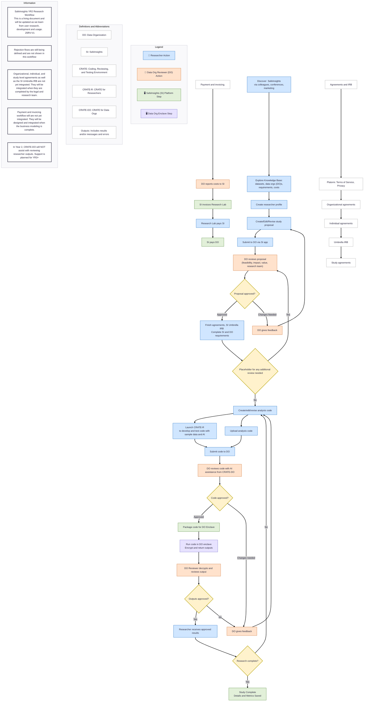

# SafeInsights YR2 Research Workflow

```mermaid
---
config:
  theme: redux
---

flowchart TD
    %% Discovery
    DISC["Discover  SafeInsights<br/> via colleagues, conferences, marketing"]
    KB["Explore Knowledge Base:<br/> datasets, data orgs (DO)s, requirements, costs"]
    PROF["Create researcher profile"]

    %% Proposal Initiation
    EDITP["Create/Edit/Revise study proposal"]
    SUBP["Submit to DO via SI app"]
    REVP["DO reviews proposal<br/>(feasibility, impact, value, research team)"]
    APP-P{"Proposal approved?"}
    FB1["DO gives feedback"]

    %% Agreements and other requirements
    AGREE["Finish agreements, SI Umbrella IRB <br/> Complete SI and DO requirements"]
    RV1{Placeholder for any additional review needed}

    %% Analysis code development
    EDITC["Create/edit/revise analysis code"]
    CRATE-R["Launch CRATE-R<br/>to develop and test code with sample data and AI"]
    UPLOAD-CODE[Upload analysis code]
    SUBC["Submit code to DO"]
    CRATE-DO["DO reviews code with AI assistance from CRATE-DO"]
    APPC{"Code approved?"}
    PACK["Package code for DO Enclave"]
    FB2["DO gives feedback"]

    %% Running
    RUN["Run code in DO enclave<br >Encrypt and return outputs"]

    %% Reviewing and returning outputs
    REVO["DO Reviewer decrypts and reviews output"]
    APPO{"Outputs approved?"}
    RES["Researcher receives approved results"]
    
    ISDONE{"Research complete?"}
    COMP[Study Complete <br/> Details and Metrics Saved]

    %% Payment system
    IP["Payment and invoicing."]
    INV-1["DO reports costs to SI"]
    INV-2["SI invoices Research Lab"]
    PAY-1["Research Lab pays SI"]
    PAY-2["SI pays DO"]

    %% Agreements and IRB subsystem
    %% subgraph Key3[Agreements and IRB]
    AGRS["Agreements and IRB"]
    PLA[Platorm: Terms of Service, Privacy]
    ORG[Organizational agreements]
    IND[Individual agreements]
    IRB["Umbrella IRB"]
    SLA[Study agreements]
    
   %% end 

    %% --- Legend ---
    subgraph Key[Legend]
        RESC["👤 Researcher Action"]
        REV["👤 Data Org Reviewer (DO) Action"]
        SIP["🖥️ SafeInsights (SI) Platform Step"]
        DOE[🖥️ Data Org Enclave Step]
    end
    
    %% --- Abbreviations ---
    subgraph Key2[Definitions and Abbreviations]
         ABBR1["DO: Data Organization"]
         ABBR2["SI: SafeInsights"]
         ABBR3["CRATE: Coding, Reviewing, and Testing Environment"] 
         ABBR4["CRATE-R: CRATE for Researchers"]
         ABBR5["CRATE-DO: CRATE for Data Orgs"]
         ABBR6["Outputs: Includes results and/or messages and errors"]
    end

%% --- Legend ---
    subgraph Key3[Information]
        LIV-I["SafeInsights YR2 Research Workflow<br/>This is a living document and will be updated as we learn from user research, development and usage.<br/> 25RV-V1"]
        REJECT["Rejection flows are still being defined and are not shown in this workflow"]
        AGRS-I["Organizational, individual, and study level agreements as well as the SI Umbrella IRB are not yet integrated. They will be integrated when they are completed by the legal and research team."]
        IP-I["Payment and invoicing workflow will are not yet integrated. They will be designed and integrated when the business modeling is complete."]
        CRATE-DO-I["In Year 2, CRATE-DO will NOT assist with reviewing researcher outputs. Support is planned for YR3+"]
    end

        %%DEC{Decision Point}

    %% --- Actor classes ---
    classDef researcher fill:#D0E6FF,stroke:#005BBB,stroke-width:1px;
    classDef dataorg fill:#FFE2CC,stroke:#C55A11,stroke-width:1px;
    classDef enclave fill:#E7E2FF,stroke:#5A51C3,stroke-width:1px;
    classDef safeinsights fill:#E2F0D9,stroke:#38761D,stroke-width:1px;
    classDef decision fill:#FFF2CC,stroke:#B7A100,stroke-width:2px;
    classDef info fill:#FFFFFF,stroke:#CCCCCC,stroke-width:2px;

    %% --- Assign nodes ---
    class RESC,DISC,KB,PROF,EDITP,SUBP,AGREE,EDITC,CRATE-R,UPLOAD-CODE,SUBC,RES,PAY-1 researcher;
    class REV,REVP,G,CRATE-DO,REVO,FB1,FB2,INV-1 dataorg;
    class APP-P,E,APPC,APPO,ISDONE,RV1 decision;
    class SIP,PACK,COMP,INV-2,PAY-2 safeinsights;
    class DOE,RUN enclave;
    class ABBR5,ABBR1,ABBR2,ABBR3,ABBR4,ABBR6,IP,AGRS info;
    class AGRS,PLA,ORG,IND,SLA,IRB info;

    %% Main proposal flow
    DISC --> KB --> PROF --> EDITP --> SUBP --> REVP --> APP-P
    APP-P -->|Approved| AGREE --> RV1  
    APP-P -->|Changes Needed| FB1 --> EDITP
    RV1 -->|No| EDITC --> CRATE-R
    EDITC --> UPLOAD-CODE --> SUBC
    RV1 -->|Yes| REVP
   %% E -->[Proposal Rejected] --> Q
   
    %% Optional additional proposal flow


    %% Code development & review
    CRATE-R --> SUBC --> CRATE-DO --> APPC
    APPC -->|Approved| PACK --> RUN --> REVO --> APPO
    APPC -->|Changes needed| FB2 --> EDITC

    %% Output review
    APPO -->|Yes| RES
    APPO -->|No| FB2

    %% Post-results & repeat loop
    RES --> ISDONE
    ISDONE -->|Yes| COMP
    ISDONE -->|No| EDITC

    %% Payment flow    
    IP --> INV-1 --> INV-2 --> PAY-1 --> PAY-2

    %% Agreements flow
    AGRS --> PLA --> ORG --> IND --> IRB --> SLA
```
