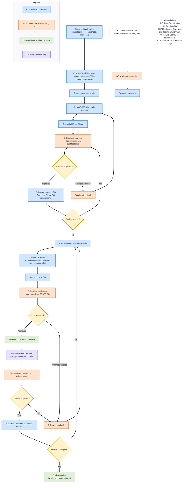

```mermaid
---
config:
    theme: redux
---
flowchart TD
    DISC["Discover  SafeInsights<br/> via colleagues, conferences, marketing"]
    KB["Explore Knowledge Base:<br/> datasets, data orgs (DO)s, requirements, costs"]
    PROF["Create researcher profile"]
    EDITP["Create/Edit/Revise study proposal"]
    SUBP["Submit to DO via SI app"]
    REVP["DO reviews proposal<br/>(feasibility, impact, qualifications)"]
    APP-P{"Proposal approved?"}
    FB1["DO gives feedback"]
    AGREE["Finish agreements, IRB <br/> Complete SI and DO requirements"]
    RV1{Review needed?}

    EDITC["Create/edit/revise analysis code"]
    CRATE-R["Launch CRATE-R<br/>to develop and test code with sample data and AI"]
    SUBC["Submit code to DO"]
    CRATE-DO["DO reviews code with assistance from CRATE-DO"]
    APPC{"Code approved?"}
    PACK["Package code for DO Enclave"]
    FB2["DO gives feedback"]
    RUN["Run code in DO enclave<br >Encrypt and return outputs"]
    REVO["DO Reviewer decrypts and reviews output"]
    APPO{"Outputs approved?"}
    RES["Researcher receives approved results"]
    
    ISDONE{"Research complete?"}
    COMP[Study Complete <br/> Details and Metrics Saved]

    IP["Payment and invoicing workflow are not yet integrated"]
    INV["DO invoices research lab"]
    PAY["Research Lab pays"]

    %% --- Legend ---
    subgraph Key[Legend]
        RESC["👤 Researcher Action"]
        REV["👤 Data Org Reviewer (DO) Action"]
        SIP["SafeInsights (SI) Platform Step"]
        DOE[Data Org Enclave Step]
    end
    
    %% --- Abbreviations ---
    ABBR["Abbreviations<br/>DO: Data Organization<br/>SI: SafeInsights<br/> CRATE: Coding, Reviewing, and Testing Environment <br/>CRATE-R: CRATE for Researchers <br/>CRATE-DO: CRATE for Data Orgs"]
        %%DEC{Decision Point}

    %% --- Actor classes ---
    classDef researcher fill:#D0E6FF,stroke:#005BBB,stroke-width:1px;
    classDef dataorg fill:#FFE2CC,stroke:#C55A11,stroke-width:1px;
    classDef enclave fill:#E7E2FF,stroke:#5A51C3,stroke-width:1px;
    classDef safeinsights fill:#E2F0D9,stroke:#38761D,stroke-width:1px;
    classDef decision fill:#FFF2CC,stroke:#B7A100,stroke-width:2px;
    classDef info fill:#FFFFFF,stroke:#CCCCCC,stroke-width:2px;

    %% --- Assign nodes ---
    class RESC,DISC,KB,PROF,EDITP,SUBP,AGREE,EDITC,CRATE-R,SUBC,RES,PAY researcher;
    class REV,REVP,G,CRATE-DO,REVO,FB1,FB2,INV dataorg;
    class APP-P,E,APPC,APPO,ISDONE,RV1 decision;
    class SIP,PACK,COMP safeinsights;
    class DOE,RUN enclave;
    class ABBR,IP info;

    %% Main proposal flow
    DISC --> KB --> PROF --> EDITP --> SUBP --> REVP --> APP-P
    APP-P -->|Approved| AGREE --> RV1  
    APP-P -->|Changes Needed| FB1 --> EDITP
    RV1 -->|No| EDITC --> CRATE-R
    RV1 -->|Yes| REVP
   %% E -->[Proposal Rejected] --> Q
   
    %% Optional additional proposal flow


    %% Code development & review
    CRATE-R --> SUBC --> CRATE-DO --> APPC
    APPC -->|Approved| PACK --> RUN --> REVO --> APPO
    APPC -->|Changes needed| FB2 --> EDITC

    %% Output review
    APPO -->|Yes| RES
    APPO -->|No| FB2

    %% Post-results & repeat loop
    RES --> ISDONE
    ISDONE -->|Yes| COMP
    ISDONE -->|No| EDITC

    %% Payment flow    
    IP --> INV --> PAY
```
